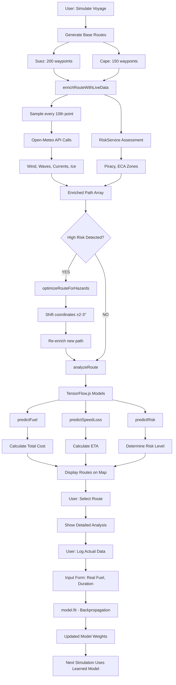

# Maritime Route Optimization System - Complete Project Documentation

## Table of Contents
1. [Project Overview](#project-overview)
2. [Technology Stack](#technology-stack)
3. [System Architecture](#system-architecture)
4. [Data Sources & Live Streams](#data-sources--live-streams)
5. [Input Parameters & Definitions](#input-parameters--definitions)
6. [Route Generation & Construction](#route-generation--construction)
7. [ML Models & Predictions](#ml-models--predictions)
8. [Formulas & Calculations](#formulas--calculations)
9. [Data Flow & Processing](#data-flow--processing)
10. [Voyage Analysis & Logging](#voyage-analysis--logging)
11. [Hardcoded Values & APIs](#hardcoded-values--apis)
12. [Component Breakdown](#component-breakdown)

---

## Project Overview

### Purpose
A web-based maritime routing system that:
- Generates realistic shipping routes between major ports
- Fetches real-time environmental data (wind, waves, currents, ice, piracy)
- Uses in-browser ML models to predict fuel consumption, speed loss, and risk
- Automatically deviates routes to avoid hazards
- Learns from actual voyage data through on-device model retraining

### Key Features
- **Route Generation**: Suez Canal vs Cape of Good Hope routing
- **Live Data Integration**: Real-time weather, ocean conditions, and risk assessment
- **ML Predictions**: TensorFlow.js models for fuel, speed, and risk
- **Hazard Avoidance**: Automatic route deviation for storms, ice, and piracy
- **Cost Analysis**: Fuel consumption with ECA zone pricing
- **Voyage Logging**: User feedback loop for model improvement

---

## Technology Stack

### Frontend Framework
- **React 18.3.1**: Component-based UI framework
- **Vite 5.4.1**: Fast development server and build tool
- **JavaScript ES6+**: Modern JavaScript with modules

### Mapping & Visualization
- **Leaflet 1.9.4**: Open-source mapping library
- **React-Leaflet 4.2.1**: React integration for Leaflet
- **CartoDB Dark**: Base map tiles for maritime visualization

### Machine Learning
- **TensorFlow.js 4.22.0**: In-browser ML framework
- **WebGL Backend**: GPU acceleration for model inference

### Styling & UI
- **Tailwind CSS 4.1.18**: Utility-first CSS framework
- **Framer Motion 12.24.0**: Animation library
- **Lucide React 0.562.0**: Icon library

### Development Tools
- **PostCSS 8.5.6**: CSS processing
- **Autoprefixer 10.4.23**: CSS vendor prefixing

---

## System Architecture

### File Structure
```
src/
├── App.jsx                    # Main application component
├── main.jsx                   # React entry point
├── components/
│   ├── ShipInputForm.jsx      # User input panel
│   └── RouteAnalysisPanel.jsx # Results display
├── models/
│   └── predictors.js          # TensorFlow.js ML models
├── services/
│   ├── WeatherService.js      # Wind & wave data
│   ├── OceanService.js        # Currents & ice data
│   ├── RiskService.js         # Piracy & ECA zones
│   └── PortService.js         # Port congestion simulation
├── utils/
│   └── maritime.js            # Core routing logic
└── test-*.mjs                 # Service and model tests
```

### Component Hierarchy
```
App (Root)
├── ShipInputForm (Input Panel)
│   └── Form Fields (Ship specs, voyage params)
├── RouteAnalysisPanel (Results)
│   └── Route Cards (Stats, recommendations)
└── Leaflet Map (Visualization)
    └── Route Polylines (Color-coded by risk)
```

---

## Data Sources & Live Streams

### 1. Weather Data (WeatherService.js)

**API Source**: Open-Meteo Marine API
- **Primary**: `https://marine-api.open-meteo.com/v1/marine`
- **Secondary**: `https://api.open-meteo.com/v1/forecast`

**Data Fetched**:
- **Wind Speed**: km/h → converted to knots (× 0.539957)
- **Wind Direction**: Degrees (0-360)
- **Wave Height**: Meters
- **Wave Direction**: Degrees (0-360)

**Caching Strategy**:
- 15-minute TTL per coordinate
- Key: `lat,lon` formatted to 2 decimal places
- Prevents API spam during route analysis

**Fallback Values** (API failure):
```javascript
{
  windSpeed: 0,
  waveHeight: 1.5,
  windDirection: null,
  waveDirection: 0
}
```

### 2. Ocean Conditions (OceanService.js)

**API Source**: Same Open-Meteo Marine API

**Data Fetched**:
- **Current Velocity**: m/s → converted to knots (× 1.94384)
- **Current Direction**: Degrees (0-360)
- **Sea Ice Cover**: Percentage (0-100%)

**Ice Detection Logic**:
```javascript
ice = icePercentage > 10  // Blocked if >10% coverage
```

### 3. Risk Assessment (RiskService.js)

**Static Data Sources** (Hardcoded bounding boxes):

**Piracy Zones**:
```javascript
HIGH_RISK_ZONES = [
  { name: 'Gulf of Aden', latMin: 10, latMax: 15, lonMin: 42, lonMax: 54 },
  { name: 'Somali Coast', latMin: -5, latMax: 12, lonMin: 40, lonMax: 52 },
  { name: 'Gulf of Guinea', latMin: -5, latMax: 8, lonMin: -10, lonMax: 10 }
]
```

**ECA Zones** (Emission Control Areas):
```javascript
ECA_ZONES = [
  { name: 'North Sea', latMin: 51, latMax: 62, lonMin: -5, lonMax: 10 },
  { name: 'Baltic Sea', latMin: 53, latMax: 66, lonMin: 10, lonMax: 30 }
]
```

**Risk Output**:
```javascript
{ piracy: 'HIGH'|'LOW', eca: true|false }
```

### 4. Port Congestion (PortService.js)

**Algorithm**:
```javascript
// Base congestion for known busy ports
busyPorts = ['Shanghai', 'Singapore', 'Rotterdam', 'Los Angeles']
baseCongestion = busyPorts.includes(portName) ? 0.4 : 0.1

// Add random noise ±20%
congestion = baseCongestion + (Math.random() - 0.5) * 0.2
```

**Output**: Float between 0.0 (no congestion) and 1.0 (fully congested)

---

## Input Parameters & Definitions

### Ship Specifications (identity)
- **type**: Vessel category (Container, Bulk, VLCC, LNG)
- **dwt**: Deadweight tonnage (tons) - *Primary size metric*
- **loa**: Length overall (meters)
- **beam**: Vessel width (meters)

### Propulsion System (propulsion)
- **engineType**: Main engine configuration
- **mcr**: Maximum continuous rating (kW) - *Power output*
- **fuelType**: Fuel specification (VLSFO, MGO, LNG)
- **sfc**: Specific fuel consumption (g/kWh) - *Efficiency metric*
- **fuelPrice**: Cost per ton ($)

### Speed Profile (speed)
- **designSpeed**: Maximum service speed (knots)
- **ecoSpeed**: Economical speed (knots)
- **maxSafeSpeed**: Weather-limited speed (knots)

### Hull Condition (hull)
- **age**: Vessel age (years) - *Affects efficiency*
- **hullIndex**: Hull cleanliness index (0-1)
- **maintenance**: Maintenance quality level

### Loading Condition (loading)
- **loadPercent**: Current load factor (0-1)
- **draft**: Vessel draft (meters)
- **gm**: Metacentric height (meters) - *Stability*

### Emissions (emissions)
- **co2Factor**: CO2 emission factor (t CO2/t fuel)
- **eexi**: Energy Efficiency Existing Ship Index
- **ciiTarget**: Carbon Intensity Indicator target

### Operational Rules (rules)
- **maxWave**: Maximum acceptable wave height (meters)
- **maxWind**: Maximum acceptable wind speed (knots)
- **piracyTolerance**: Risk acceptance level

### Voyage Parameters (voyage)
- **origin**: Departure port name
- **destination**: Arrival port name
- **fuelBudget**: Available fuel budget (tons)

---

## Route Generation & Construction

### Supported Route Pairs

**1. Rotterdam ↔ Shanghai**
- **Suez Route**: 28 waypoints via Mediterranean, Red Sea, Indian Ocean
- **Cape Route**: 19 waypoints via West Africa, South Atlantic

**2. Singapore ↔ Rotterdam**
- **Suez Route**: Reverse of Rotterdam-Shanghai
- **Cape Route**: Indian Ocean, South Atlantic

**3. Los Angeles ↔ Tokyo**
- **Trans-Pacific**: Direct Pacific crossing (single route option)

**4. Dubai ↔ New York**
- **Suez Route**: Mediterranean, Atlantic
- **Cape Route**: Around Africa

### Route Construction Algorithm

**Step 1: Waypoint Definition**
```javascript
// Example: Suez Route waypoints
waypoints = [
  [51.92, 4.48],   // Rotterdam
  [51.0, 1.5],     // Dover Strait
  [49.0, -5.0],    // Bay of Biscay
  // ... 25 more waypoints
  [31.23, 121.47]  // Shanghai
]
```

**Step 2: Linear Interpolation**
```javascript
for each waypoint segment:
  distance = sqrt((lat2-lat1)² + (lon2-lon1)²)
  steps = max(5, floor(distance * 2))  // 1 point per 0.5°
  
  for j from 0 to steps:
    t = j / steps
    lat = lat1 + (lat2-lat1) * t
    lon = lon1 + (lon2-lon1) * t
    route.push({lat, lon})
```

**Step 3: Route Enrichment**
- Sample every 10th point for API calls
- Fetch weather, ocean, and risk data
- Fill gaps with last known values

---

## ML Models & Predictions

### 1. Fuel Consumption Predictor

**Architecture**:
```javascript
Sequential([
  Dense(20, inputShape=[5], activation='relu'),
  Dense(10, activation='relu'),
  Dense(1, activation='linear')  // Regression output
])
```

**Input Features** (5):
1. **dwt**: Deadweight tonnage (tons)
2. **speed**: Ship speed (knots)
3. **waveHeight**: Significant wave height (meters)
4. **windSpeed**: Wind speed (knots)
5. **currentSpeed**: Ocean current speed (knots)

**Output**: Fuel consumption (tons/day)

**Training Data Generation** (Physics-Informed):
```javascript
// Simplified Admiralty Formula approximation
fuel = (dwt/10000) * Math.pow(speed/12, 3) + (wave * 2) + (wind * 0.5) - (current * 2)
```

**Usage**:
```javascript
dailyFuel = predictFuel(model, { dwt, speed, waveHeight, windSpeed, currentSpeed })
hours = distance / speed
totalFuel = (dailyFuel / 24) * hours
```

### 2. Speed Loss Predictor

**Architecture**:
```javascript
Sequential([
  Dense(10, inputShape=[3], activation='relu'),
  Dense(5, activation='relu'),
  Dense(1, activation='linear')
])
```

**Input Features** (3):
1. **speed**: Design speed (knots)
2. **waveHeight**: Wave height (meters)
3. **windSpeed**: Wind speed (knots)

**Output**: Speed loss (knots)

**Training Formula**:
```javascript
speedLoss = (wave * 0.3) + (wind * 0.05)
```

**Usage**:
```javascript
realSpeed = designSpeed - predictSpeedLoss(model, { speed, waveHeight, windSpeed })
```

### 3. Risk Classifier

**Architecture**:
```javascript
Sequential([
  Dense(16, inputShape=[4], activation='relu'),
  Dense(8, activation='relu'),
  Dense(3, activation='softmax')  // 3 classes: LOW, MEDIUM, HIGH
])
```

**Input Features** (4):
1. **windSpeed**: Wind speed (knots)
2. **waveHeight**: Wave height (meters)
3. **congestion**: Port congestion (0-1)
4. **piracy**: Piracy risk (0 or 1)

**Output**: Probability distribution `[P(LOW), P(MEDIUM), P(HIGH)]`

**Training Logic**:
```javascript
if (wind > 45 || wave > 6 || piracy === 1) → HIGH
else if (wind > 30 || wave > 4) → MEDIUM
else → LOW
```

---

## Formulas & Calculations

### 1. Distance Calculation (Haversine)

```javascript
R = 3440  // Earth radius in nautical miles

dLat = (lat2 - lat1) * π/180
dLon = (lon2 - lon1) * π/180

a = sin²(dLat/2) + cos(lat1) * cos(lat2) * sin²(dLon/2)
c = 2 * atan2(√a, √(1-a))

distance = R * c  // Nautical miles
```

### 2. Fuel Consumption (Physics Fallback)

```javascript
// 1. Base Power (Admiralty Approximation)
effectiveSpeed = speed - currentSpeed * cos(currentDirection)
speedRatio = effectiveSpeed / designSpeed
power = MCR * Math.pow(speedRatio, 3)

// 2. Weather Resistance
weatherFactor = 1.0
if (waveHeight > 2.0):
  weatherFactor += 0.1 * (waveHeight - 2.0)
if (windSpeed > 20):
  weatherFactor += 0.05 * (windSpeed - 20) / 10
power *= weatherFactor

// 3. Hull Fouling
hullFactor = 1 + (shipAge * 0.01)
power *= hullFactor

// 4. Fuel Calculation
SFC = 165  // g/kWh (Specific Fuel Consumption)
hours = distance / speed
fuelTons = (power * SFC * hours) / 1,000,000
```

### 3. ECA Fuel Cost Calculation

```javascript
// Count segments within ECA zones
ecaSegments = enrichedPath.filter(p => p.eca).length
ecaRatio = ecaSegments / enrichedPath.length

// Fuel pricing
baseFuelPrice = 650  // $/ton VLSFO
ecaFuelPrice = baseFuelPrice + 250  // $/ton MGO premium

// Weighted average
avgFuelPrice = baseFuelPrice * (1 - ecaRatio) + ecaFuelPrice * ecaRatio

totalCost = fuelTons * avgFuelPrice / 1000  // in $k
```

### 4. Port Congestion ETA Penalty

```javascript
congestionDelayHours = (congOrigin + congDest) * 24

// Example: If origin = 0.5, dest = 0.3
// Delay = (0.5 + 0.3) * 24 = 19.2 hours

hours = distance / speed
etaDays = (hours + congestionDelayHours) / 24
```

### 5. Speed Loss Calculation

```javascript
speedLoss = 0.3 * waveHeight + 0.05 * windSpeed
realSpeed = max(5, designSpeed - speedLoss)
```

---

## Data Flow & Processing

### Complete Voyage Simulation Flow



### Step-by-Step Processing

**1. Initialization**
```javascript
// Map setup
map = L.map(container, { center: [20, 50], zoom: 3 })
L.tileLayer('CartoDB Dark').addTo(map)

// ML model initialization
fuelModel = await createFuelPredictorModel()
speedModel = await createSpeedLossModel()
riskModel = await createRiskClassifierModel()
```

**2. Route Generation**
```javascript
pathSuez = generateComplexRoute(origin, dest, 'Suez')  // ~200 points
pathCape = generateComplexRoute(origin, dest, 'Cape')  // ~150 points
```

**3. Data Enrichment**
```javascript
[enrichedSuez, enrichedCape, congOrigin, congDest] = await Promise.all([
  enrichRouteWithLiveData(pathSuez),   // ~20 API calls
  enrichRouteWithLiveData(pathCape),
  getPortCongestion(origin),
  getPortCongestion(dest)
])
```

**4. Hazard Optimization**
```javascript
if (stats.risk === 'HIGH') {
  optimizedPath = optimizeRouteForHazards(enrichedPath)
  if (optimizedPath) {
    reEnriched = await enrichRouteWithLiveData(optimizedPath)
    stats = analyzeRoute(reEnriched, name, color)
  }
}
```

**5. Analysis & Display**
```javascript
for each segment in enrichedPath:
  color = (isStorm || isIce || isPiracy) ? RED : routeColor
  L.polyline([p1, p2], { color, weight }).addTo(map)
  
  tooltip = `
    🌊 Waves: ${waveHeight}m
    💨 Wind: ${windSpeed}kts
    🧊 Ice: ${ice ? 'YES' : 'NO'}
    🏴‍☠️ Piracy: ${piracy}
  `
```

---

## Voyage Analysis & Logging

### Route Analysis Metrics

**For each route**:
- **Distance**: Total nautical miles (sum of great circle segments)
- **Fuel Consumption**: ML prediction or physics calculation
- **Cost**: Fuel cost with ECA zone pricing
- **ETA**: Time including congestion delays
- **Risk Level**: LOW/MEDIUM/HIGH from ML classifier
- **Weather Stats**: Average wind/wave along route
- **Risk Segments**: Count of high-risk waypoints

### User Feedback Loop

**1. Route Selection**
- User clicks on preferred route card
- System displays detailed route information
- Shows cached path with all waypoints

**2. Voyage Logging**
- User inputs actual voyage data:
  - Real fuel consumed
  - Actual duration
  - Any incidents or deviations

**3. Model Retraining**
```javascript
// Convert user feedback to training data
const actualFuel = userFeedback.fuelConsumed
const predictedFuel = routeStats.fuelML
const error = actualFuel - predictedFuel

// Update model weights
await model.fit(
  tf.tensor2d([inputFeatures]),
  tf.tensor2d([[actualFuel]]),
  { epochs: 5, verbose: 0 }
)
```

**4. Continuous Improvement**
- Each logged voyage improves model accuracy
- System learns from real-world performance
- Predictions become more accurate over time

---

## Hardcoded Values & APIs

### Static Geographic Data

**Port Coordinates**:
```javascript
PORTS = {
  'Rotterdam': { lat: 51.92, lon: 4.48 },
  'Shanghai': { lat: 31.23, lon: 121.47 },
  'Singapore': { lat: 1.29, lon: 103.85 },
  'Los Angeles': { lat: 33.74, lon: -118.27 },
  'Tokyo': { lat: 35.65, lon: 139.84 },
  'Dubai': { lat: 25.27, lon: 55.30 },
  'New York': { lat: 40.71, lon: -74.01 }
}
```

**Route Waypoints**: Predefined for each major shipping lane
- Suez Canal transit points
- Cape of Good Hope routing
- Trans-Pacific waypoints
- Panama Canal alternatives

### API Endpoints

**Primary Weather API**:
```
https://marine-api.open-meteo.com/v1/marine
Parameters: latitude, longitude, hourly=wave_height,wave_direction,wind_speed_10m,wind_direction_10m
```

**Secondary Weather API**:
```
https://api.open-meteo.com/v1/forecast
Parameters: latitude, longitude, hourly=wind_speed_10m,wind_direction_10m
```

### Default Ship Parameters

**Container Ship (75k DWT)**:
```javascript
DEFAULT_INPUTS = {
  identity: { type: 'Container Ship', dwt: 75000, loa: 230, beam: 32 },
  propulsion: { engineType: '2-Stroke Diesel', mcr: 18000, fuelType: 'VLSFO', sfc: 165, fuelPrice: 650 },
  speed: { designSpeed: 20, ecoSpeed: 14, maxSafeSpeed: 16 },
  hull: { age: 7, hullIndex: 0.85, maintenance: 'Good' },
  loading: { loadPercent: 0.75, draft: 11.5, gm: 0.95 },
  emissions: { co2Factor: 3.114, eexi: 0.98, ciiTarget: 'B' },
  rules: { maxWave: 4.5, maxWind: 35, piracyTolerance: 'Low' },
  voyage: { origin: 'Rotterdam', destination: 'Shanghai', fuelBudget: 2800 }
}
```

### Physical Constants

```javascript
EARTH_RADIUS_NM = 3440        // Nautical miles
KMH_TO_KNOTS = 0.539957       // Conversion factor
MS_TO_KNOTS = 1.94384         // Conversion factor
SFC_DEFAULT = 165             // g/kWh (Specific Fuel Consumption)
FUEL_PRICE_VLSFO = 650        // $/ton
FUEL_PRICE_MGO = 900          // $/ton (ECA premium)
```

---

## Component Breakdown

### App.jsx (Main Component)

**Responsibilities**:
- Application state management
- Map initialization and control
- Route simulation orchestration
- ML model loading and management

**Key Functions**:
- `handleSimulate()`: Main simulation trigger
- `checkAndOptimize()`: Hazard detection and avoidance
- `analyzeRoute()`: Route statistics calculation
- `displayRoutes()`: Map visualization

### ShipInputForm.jsx

**Input Categories**:
1. **Vessel Specifications**: Ship type, dimensions, DWT
2. **Propulsion System**: Engine, fuel, efficiency
3. **Speed Profile**: Design, eco, maximum speeds
4. **Hull Condition**: Age, maintenance, cleanliness
5. **Loading Condition**: Draft, stability, cargo factor
6. **Emissions**: CO2 factors, regulatory compliance
7. **Operational Rules**: Weather limits, risk tolerance
8. **Voyage Parameters**: Origin, destination, budget

### RouteAnalysisPanel.jsx

**Display Elements**:
- Route comparison cards
- Fuel consumption estimates
- ETA calculations
- Risk assessments
- Cost breakdowns
- Recommendations

**Interactive Features**:
- Route selection
- Detailed view toggle
- Voyage logging form
- Model feedback input

### Services Layer

**WeatherService.js**:
- Dual API fetching strategy
- 15-minute caching mechanism
- Unit conversions (km/h → knots)
- Error handling with fallbacks

**OceanService.js**:
- Current velocity calculations
- Sea ice detection
- Directional data processing

**RiskService.js**:
- Static zone checking (piracy, ECA)
- Bounding box calculations
- Risk level determination

**PortService.js**:
- Congestion simulation
- Known port prioritization
- Random variation generation

### Utils Layer (maritime.js)

**Core Functions**:
- `generateComplexRoute()`: Waypoint interpolation
- `enrichRouteWithLiveData()`: API data integration
- `calculateGCDistance()`: Haversine distance
- `estimateFuel()`: ML or physics-based calculation
- `optimizeRouteForHazards()`: Route deviation logic
- `analyzeRoute()`: Comprehensive statistics

### Models Layer (predictors.js)

**TensorFlow.js Models**:
- Fuel predictor (regression)
- Speed loss predictor (regression)
- Risk classifier (3-class softmax)

**Training Strategy**:
- Physics-informed initialization
- Synthetic data generation
- Quick training (20 epochs)
- Continuous learning from user feedback

---

## Deployment & Testing

### Development Environment
```bash
npm run dev    # Development server (localhost:5173)
npm run build  # Production build
```

### Test Scripts
```bash
node src/test-services.mjs      # API connectivity tests
node src/test-models.mjs        # ML model validation
node src/test-hazard-avoidance.mjs  # Route optimization tests
```

### Browser Requirements
- Chrome/Edge 90+ (WebGL support for TensorFlow.js)
- Firefox 88+ (WebGL backend)
- Safari 14+ (Metal backend)

### Performance Optimizations
- API caching (15-minute TTL)
- Route sampling (10% of points for API calls)
- Parallel data fetching
- WebGL acceleration for ML models
- Lazy loading of route details

---

*End of Complete Project Documentation*
