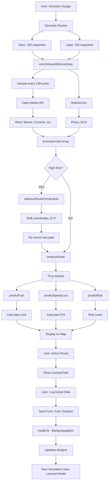

# Maritime Route Optimization System - Complete Technical Specification

## Table of Contents
1. [System Overview](#system-overview)
2. [Architecture & File Structure](#architecture--file-structure)
3. [Data Layer - Live Stream Services](#data-layer---live-stream-services)
4. [ML Models - TensorFlow.js Implementation](#ml-models---tensorflowjs-implementation)
5. [Core Logic - Route Generation & Analysis](#core-logic---route-generation--analysis)
6. [UI Flow & User Interaction](#ui-flow--user-interaction)
7. [Optimization Loop - Hazard Avoidance](#optimization-loop---hazard-avoidance)
8. [Complete Data Flow](#complete-data-flow)

---

## System Overview

### Purpose
A web-based maritime routing engine that:
- Generates realistic shipping routes (Suez Canal vs Cape of Good Hope)
- Fetches real-time environmental data (wind, waves, currents, ice, piracy)
- Uses in-browser ML models to predict fuel consumption, speed loss, and risk
- Automatically deviates routes to avoid hazards
- Learns from actual voyage data through on-device model retraining

### Technology Stack
- **Frontend**: React + Vite
- **Mapping**: Leaflet.js
- **ML Framework**: TensorFlow.js (client-side)
- **Data Sources**: Open-Meteo Marine API (wind, waves, currents)
- **Styling**: Tailwind CSS

---

## Architecture & File Structure

```
src/
├── models/
│   └── predictors.js          # TF.js ML models (Fuel, Speed, Risk)
├── services/
│   ├── WeatherService.js      # GFS Wind + WaveWatch III data
│   ├── OceanService.js        # Ocean currents + Sea ice
│   ├── RiskService.js         # Piracy zones + ECA/SECA regions
│   └── PortService.js         # Port congestion simulation
├── utils/
│   └── maritime.js            # Core routing, calculations, optimization
├── components/
│   ├── ShipInputForm.jsx      # User input panel
│   └── RouteAnalysisPanel.jsx # Results display + feedback loop
└── App.jsx                    # Main orchestration
```

---

## Data Layer - Live Stream Services

### 1. WeatherService.js

**Purpose**: Fetch wind and wave data from Open-Meteo Marine API

**API Endpoint**:
```
https://marine-api.open-meteo.com/v1/marine
```

**Function**: `getMarineWeather(lat, lon)`

**Parameters Fetched**:
- `wave_height` (meters)
- `wave_direction` (degrees)
- `wind_speed_10m` (km/h → converted to knots)
- `wind_direction_10m` (degrees)

**Formula**:
```javascript
windSpeed_knots = windSpeed_kmh * 0.539957
```

**Caching**: 5-minute TTL per coordinate to reduce API calls

**Fallback**: Returns default values if API fails
```javascript
{ windSpeed: 0, waveHeight: 1.5, windDirection: null, waveDirection: 0 }
```

---

### 2. OceanService.js

**Purpose**: Fetch ocean current velocity and sea ice coverage

**API Endpoint**: Same as WeatherService (Open-Meteo Marine)

**Function**: `getOceanConditions(lat, lon)`

**Parameters Fetched**:
- `ocean_current_velocity` (m/s → converted to knots)
- `ocean_current_direction` (degrees)
- `sea_ice_cover` (percentage)

**Formulas**:
```javascript
currentSpeed_knots = currentVelocity_ms * 1.94384
ice = icePercentage > 10  // Binary: blocked if >10%
```

---

### 3. RiskService.js

**Purpose**: Assess piracy risk and regulatory zones (ECA/SECA)

**Function**: `getRiskAssessment(lat, lon)`

**Piracy Zones** (Static Bounding Boxes):
```javascript
HIGH_RISK_ZONES = [
  { name: 'Gulf of Aden', latMin: 10, latMax: 15, lonMin: 42, lonMax: 54 },
  { name: 'Somali Coast', latMin: -5, latMax: 12, lonMin: 40, lonMax: 52 },
  { name: 'Gulf of Guinea', latMin: -5, latMax: 8, lonMin: -10, lonMax: 10 }
]
```

**ECA Zones**:
```javascript
ECA_ZONES = [
  { name: 'North Sea', latMin: 51, latMax: 62, lonMin: -5, lonMax: 10 },
  { name: 'Baltic Sea', latMin: 53, latMax: 66, lonMin: 10, lonMax: 30 }
]
```

**Output**:
```javascript
{ piracy: 'HIGH'|'LOW', eca: true|false }
```

---

### 4. PortService.js

**Purpose**: Simulate port congestion levels

**Function**: `getPortCongestion(portName)`

**Algorithm**:
```javascript
// Base congestion for known busy ports
busyPorts = ['Shanghai', 'Singapore', 'Rotterdam', 'Los Angeles']
baseCongestion = busyPorts.includes(portName) ? 0.4 : 0.1

// Add random noise ±20%
congestion = baseCongestion + (Math.random() - 0.5) * 0.2
```

**Output**: Float between 0.0 (no congestion) and 1.0 (fully congested)

---

## ML Models - TensorFlow.js Implementation

### Model Architecture

All models run **entirely in the browser** using TensorFlow.js.

---

### 1. Fuel Consumption Predictor (Regression)

**File**: `src/models/predictors.js`

**Function**: `createFuelPredictorModel()`

**Architecture**:
```javascript
Sequential([
  Dense(20, inputShape=[5], activation='relu'),
  Dense(10, activation='relu'),
  Dense(1, activation='linear')  // Regression output
])
```

**Inputs** (5 features):
1. `dwt` - Deadweight Tonnage (tons)
2. `speed` - Ship speed (knots)
3. `waveHeight` - Significant wave height (meters)
4. `windSpeed` - Wind speed (knots)
5. `currentSpeed` - Ocean current speed (knots)

**Output**: Fuel consumption (tons/day)

**Training Data Generation** (Physics-Informed Initialization):
```javascript
// Simplified Admiralty Formula approximation
fuel = (dwt/10000) * (speed/12)³ + (wave * 2) + (wind * 0.5) - (current * 2)
```

**Prediction Function**:
```javascript
predictFuel(model, { dwt, speed, waveHeight, windSpeed, currentSpeed })
```

---

### 2. Speed Loss Predictor (Regression)

**Function**: `createSpeedLossModel()`

**Architecture**:
```javascript
Sequential([
  Dense(10, inputShape=[3], activation='relu'),
  Dense(5, activation='relu'),
  Dense(1, activation='linear')
])
```

**Inputs** (3 features):
1. `speed` - Design speed (knots)
2. `waveHeight` - Wave height (meters)
3. `windSpeed` - Wind speed (knots)

**Output**: Speed loss (knots)

**Training Formula**:
```javascript
speedLoss = (wave * 0.3) + (wind * 0.05)
```

**Usage**:
```javascript
realSpeed = designSpeed - predictSpeedLoss(model, { speed, waveHeight, windSpeed })
```

---

### 3. Risk Classifier (Classification)

**Function**: `createRiskClassifierModel()`

**Architecture**:
```javascript
Sequential([
  Dense(16, inputShape=[4], activation='relu'),
  Dense(8, activation='relu'),
  Dense(3, activation='softmax')  // 3 classes: LOW, MEDIUM, HIGH
])
```

**Inputs** (4 features):
1. `windSpeed` - Wind speed (knots)
2. `waveHeight` - Wave height (meters)
3. `congestion` - Port congestion (0-1)
4. `piracy` - Piracy risk (0 or 1)

**Output**: Probability distribution `[P(LOW), P(MEDIUM), P(HIGH)]`

**Training Logic**:
```javascript
if (wind > 45 || wave > 6 || piracy === 1) → HIGH
else if (wind > 30 || wave > 4) → MEDIUM
else → LOW
```

**Prediction**:
```javascript
risk = ['LOW', 'MEDIUM', 'HIGH'][argmax(probabilities)]
```

---

## Core Logic - Route Generation & Analysis

### File: `src/utils/maritime.js`

---

### 1. Route Generation

**Function**: `generateComplexRoute(origin, dest, type)`

**Type**: 'Suez' or 'Cape'

**Suez Route Waypoints** (28 points):
```
Rotterdam → Dover Strait → English Channel → Bay of Biscay → Gibraltar → 
Mediterranean → Suez Canal → Red Sea → Bab el Mandeb → Indian Ocean → 
Malacca Strait → South China Sea → Shanghai
```

**Cape Route Waypoints** (19 points):
```
Rotterdam → English Channel → West Africa → Equator → Cape Town → 
Agulhas Current → Indian Ocean → Sunda Strait → South China Sea → Shanghai
```

**Interpolation Algorithm**:
```javascript
for each waypoint segment:
  distance = sqrt((lat2-lat1)² + (lon2-lon1)²)
  steps = max(5, floor(distance * 2))  // 1 point per 0.5 degrees
  
  for j from 0 to steps:
    t = j / steps
    lat = lat1 + (lat2-lat1) * t  // Linear interpolation
    lon = lon1 + (lon2-lon1) * t
    route.push({lat, lon})
```

---

### 2. Great Circle Distance Calculation

**Function**: `calculateGCDistance(lat1, lon1, lat2, lon2)`

**Formula**: Haversine
```javascript
R = 3440  // Earth radius in nautical miles

dLat = (lat2 - lat1) * π/180
dLon = (lon2 - lon1) * π/180

a = sin²(dLat/2) + cos(lat1) * cos(lat2) * sin²(dLon/2)
c = 2 * atan2(√a, √(1-a))

distance = R * c  // Nautical miles
```

---

### 3. Route Enrichment with Live Data

**Function**: `enrichRouteWithLiveData(route)`

**Process**:
```javascript
1. For each point in route (sampled every 10th point):
   - Fetch weather: getMarineWeather(lat, lon)
   - Fetch ocean: getOceanConditions(lat, lon)
   - Assess risk: getRiskAssessment(lat, lon)
   
2. Fill gaps between sampled points with last known data

3. Return enriched route with properties:
   {
     lat, lon,
     windSpeed, windDirection,
     waveHeight, waveDirection,
     currentSpeed, currentDirection,
     ice, piracy, eca
   }
```

**Optimization**: Sampling reduces API calls by 90%

---

### 4. Fuel Estimation

**Function**: `estimateFuel(distance, speed, shipParams, env, mlParams, tfModels)`

**If ML Model Available**:
```javascript
inputs = { dwt, speed, waveHeight, windSpeed, currentSpeed }
dailyFuel = predictFuel(tfModel, inputs)
hours = distance / speed
totalFuel = (dailyFuel / 24) * hours
```

**If ML Model Not Available** (Physics Fallback):
```javascript
// 1. Base Power (Admiralty Approximation)
effectiveSpeed = speed - currentSpeed * cos(currentDirection)
speedRatio = effectiveSpeed / designSpeed
power = MCR * (speedRatio)³

// 2. Weather Resistance
weatherFactor = 1.0
if (waveHeight > 2.0):
  weatherFactor += 0.1 * (waveHeight - 2.0)
if (windSpeed > 20):
  weatherFactor += 0.05 * (windSpeed - 20) / 10
power *= weatherFactor

// 3. Hull Fouling
hullFactor = 1 + (shipAge * 0.01)
power *= hullFactor

// 4. Fuel Calculation
SFC = 165  // g/kWh (Specific Fuel Consumption)
hours = distance / speed
fuelTons = (power * SFC * hours) / 1,000,000
```

---

### 5. ECA Fuel Cost Calculation

**In**: `App.jsx` → `analyzeRoute()`

```javascript
// Count segments within ECA zones
ecaSegments = enrichedPath.filter(p => p.eca).length
ecaRatio = ecaSegments / enrichedPath.length

// Fuel pricing
baseFuelPrice = 650  // $/ton VLSFO
ecaFuelPrice = baseFuelPrice + 250  // $/ton MGO premium

// Weighted average
avgFuelPrice = baseFuelPrice * (1 - ecaRatio) + ecaFuelPrice * ecaRatio

totalCost = fuelTons * avgFuelPrice / 1000  // in $k
```

---

### 6. Port Congestion ETA Penalty

```javascript
congestionDelayHours = (congOrigin + congDest) * 24

// Example: If origin = 0.5, dest = 0.3
// Delay = (0.5 + 0.3) * 24 = 19.2 hours

hours = distance / speed
etaDays = (hours + congestionDelayHours) / 24
```

---

## UI Flow & User Interaction

### File: `src/App.jsx`

---

### Step-by-Step Execution Flow

#### 1. **Initialization**
```javascript
useEffect(() => {
  // Initialize Leaflet map
  map = L.map(container, { center: [20, 50], zoom: 3 })
  L.tileLayer('CartoDB Dark').addTo(map)
  
  // Initialize TF.js models
  async () => {
    fuelModel = await createFuelPredictorModel()
    speedModel = await createSpeedLossModel()
    riskModel = await createRiskClassifierModel()
    setTfModels({ fuel, speed, risk })
  }
})
```

---

#### 2. **User Clicks "Simulate Voyage"**

**Function**: `handleSimulate()`

```javascript
// A. Generate base routes
pathSuez = generateComplexRoute(origin, dest, 'Suez')  // ~200 points
pathCape = generateComplexRoute(origin, dest, 'Cape')  // ~150 points

// B. Fetch live data (parallel)
[enrichedSuez, enrichedCape, congOrigin, congDest] = await Promise.all([
  enrichRouteWithLiveData(pathSuez),   // Fetches ~20 API calls
  enrichRouteWithLiveData(pathCape),
  getPortCongestion('Rotterdam'),
  getPortCongestion('Shanghai')
])

// C. Optimization Loop (NEW)
checkAndOptimize = async (enrichedPath, name, color) => {
  stats = analyzeRoute(enrichedPath, name, color)
  
  if (stats.risk === 'HIGH') {
    optimizedPath = optimizeRouteForHazards(enrichedPath)
    
    if (optimizedPath) {
      reEnriched = await enrichRouteWithLiveData(optimizedPath)
      newStats = analyzeRoute(reEnriched, name, color)
      
      // Update with deviated path
      stats = newStats
      stats.name = name + " (Deviated)"
      stats.color = '#f59e0b'  // Amber
      stats.recommendation = "Route Deviated: Waypoints shifted..."
    }
  }
  return stats
}

suezStats = await checkAndOptimize(enrichedSuez, 'Suez', '#0ea5e9')
capeStats = await checkAndOptimize(enrichedCape, 'Cape', '#10b981')

// D. Display routes on map
for each segment in enrichedPath:
  color = (isStorm || isIce || isPiracy) ? RED : routeColor
  L.polyline([p1, p2], { color, weight }).addTo(map)
  
  // Add tooltip
  tooltip = `
    🌊 Waves: ${waveHeight}m
    💨 Wind: ${windSpeed}kts
    🧊 Ice: ${ice ? 'YES' : 'NO'}
    🏴‍☠️ Piracy: ${piracy}
  `
  polyline.bindTooltip(tooltip)

setRoutes([suezStats, capeStats])
```

---

#### 3. **Route Analysis**

**Function**: `analyzeRoute(enrichedPath, name, color)`

```javascript
// Aggregate stats
for each point in enrichedPath:
  totalDistance += calculateGCDistance(p1, p2)
  totalWaves += waveHeight
  totalWind += windSpeed
  if (ice) blockedByIce = true
  if (storm || ice || piracy) highRiskCount++

avgWave = totalWaves / enrichedPath.length
avgWind = totalWind / enrichedPath.length

// ML Predictions
fuelTotal = estimateFuel(totalDist, speed, shipParams, { avgWave, avgWind }, mlParams, tfModels)

speedLoss = getSpeedLoss(speed, { avgWave, avgWind }, tfModels)
realSpeed = max(5, speed - speedLoss)

hours = totalDist / realSpeed
etaDays = (hours + congestionDelayHours) / 24

risk = getRiskClass({ avgWind, avgWave }, avgCongestion, piracyLevel, tfModels)

return {
  name, color, distance, fuelML, cost, etaML, avgWave, avgWind,
  riskSegments, risk, recommendation, path: enrichedPath
}
```

---

## Optimization Loop - Hazard Avoidance

### File: `src/utils/maritime.js`

**Function**: `optimizeRouteForHazards(enrichedRoute)`

**Algorithm**:
```javascript
newPath = deepCopy(enrichedRoute)
hasDeviation = false

for each point in enrichedRoute:
  // Detect Hazard
  if (waveHeight > 5.0 || windSpeed > 40 || piracy === 'HIGH'):
    hasDeviation = true
    
    // Apply Geometric Shift
    if (piracy === 'HIGH'):
      newPath[i].lat -= 2.0  // Move South (away from Somali coast)
      newPath[i].lon += 1.0  // Move East
    else:  // Storm
      newPath[i].lat += 3.0  // Move North (skirt storm track)

return hasDeviation ? newPath : null
```

**Example**:
```
Original Point: { lat: 12.0, lon: 45.0, piracy: 'HIGH' }
Deviated Point: { lat: 10.0, lon: 46.0 }
Offset: -2° Lat, +1° Lon (~138nm South, ~60nm East)
```

---

## Complete Data Flow

### Full Voyage Simulation Flow



---

## Formulas Reference

### Distance
```
Haversine: d = 2R * arcsin(√[sin²(Δφ/2) + cos(φ1)cos(φ2)sin²(Δλ/2)])
```

### Fuel (Physics)
```
P = MCR * (v/v₀)³ * weatherFactor * hullFactor
F = (P * SFC * t) / 10⁶
```

### Speed Loss
```
v_loss = 0.3 * H_wave + 0.05 * W_wind
```

### ECA Cost
```
C_total = F_total * [P_base(1-r) + P_eca(r)]
where r = segments_in_eca / total_segments
```

### Congestion Delay
```
Δt = 24 * (C_origin + C_dest)  hours
```

### Risk Score (ML)
```
P(risk_class) = softmax([P_LOW, P_MED, P_HIGH])
class = argmax(P)
```

---

## Test Scripts

### 1. Service Verification
```bash
node src/test-services.mjs
```
Validates API connectivity for Weather, Ocean, and Port services.

### 2. Model Verification
```bash
node src/test-models.mjs
```
Tests TF.js models produce valid predictions.

### 3. Hazard Avoidance
```bash
node src/test-hazard-avoidance.mjs
```
Confirms geometric deviations work correctly.

---

## Deployment

```bash
npm run dev    # Development (localhost:5173)
npm run build  # Production bundle
```

**Browser Requirements**: Chrome/Edge 90+, Firefox 88+ (for TensorFlow.js WebGL backend)

---

*End of Technical Specification*
